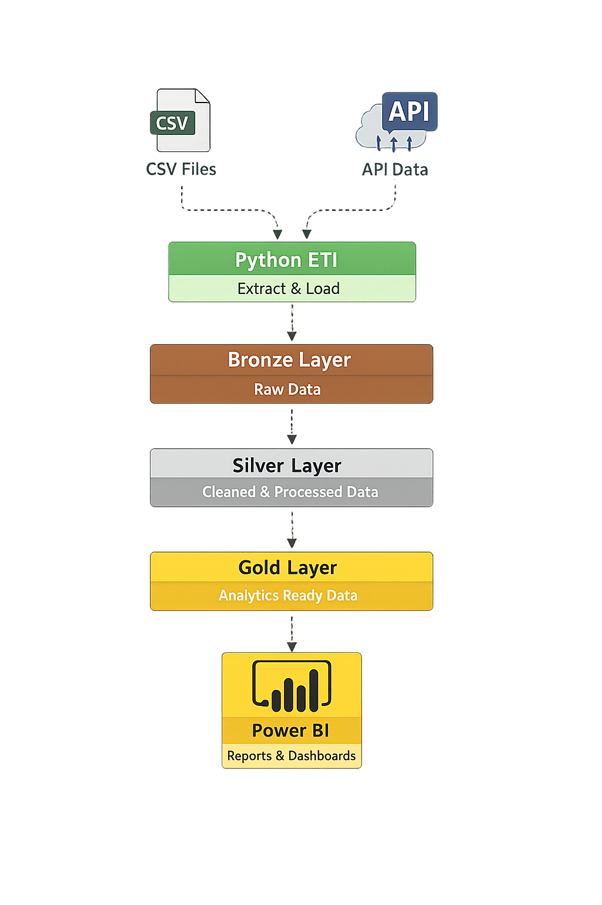

# Automated US Stock ETL Pipeline Project

An automated ETL pipeline that loads, processes, and stores US stock price and market holiday data into a SQL Server database. Data ingestion runs daily at 08:00 AM, handles incremental loads, and supports a multi-layer architecture: Raw, Silver (Clean), and Gold (Analytics).

## Table of Contents

1. [Architecture](#architecture)
2. [Features](#features)
3. [Used Languages and Modules](#used-languages-and-modules)
4. [ETL Steps](#etl-steps)
5. [Incremental Loading Strategy](#incremental-loading-strategy)
6. [Database Schema](#database-schema)
7. [Logging & Monitoring](#logging--monitoring)
8. [Visualizsation](#visualisation)
9. [Known Issues](#known-issues)
10. [Future Improvements](#future-improvements)

## Architecture

Raw (Bronze) → Clean (Silver) → Analytics (Gold)

- Raw: Original unprocessed data
- Clean: Type-casted, deduplicated
- Analytics: Business ready fact/dimension tables

## Features

- Incremental loading
- Modular Python ETL scripts
- SQL Server stored procedures for staging/clean
- Automation using SQL Server Agent
- Logging with timestamped logs
- Designed for daily production runs

## Used Languages and Modules

- Python 3.12
- pandas
- yfinance
- finnhub
- pyodbc
- SQL Server with ODBC Driver 17
- SQL Server Agent

## Visualisation

I built a Power BI report to validate the analytics readiness of the Gold layer.
This is a simple, single-page verification dashboard designed to confirm that the data pipeline is running automatically on a daily basis.

By building this dashboard, I was able to demonstrate that the data is truly analytics-ready, as the visuals did not require any complex DAX or Power Query transformations.
Because the final dataset was already optimised for visualisation, the report refreshed in under one second, indicating both efficiency and good data modelling practices.

