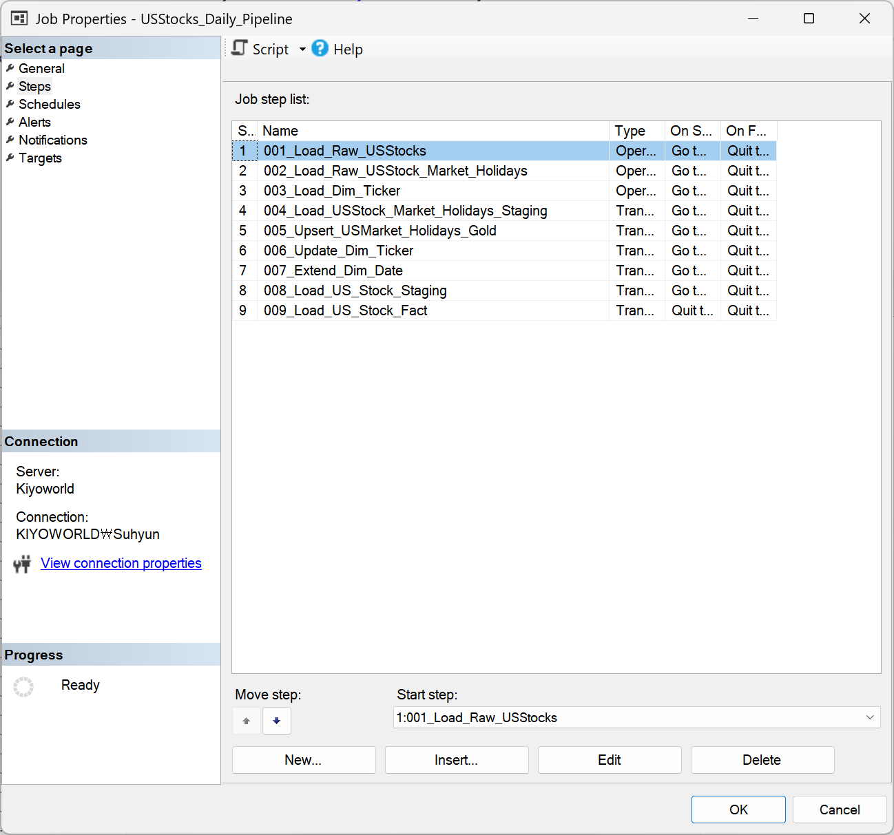
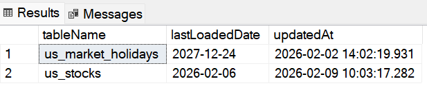
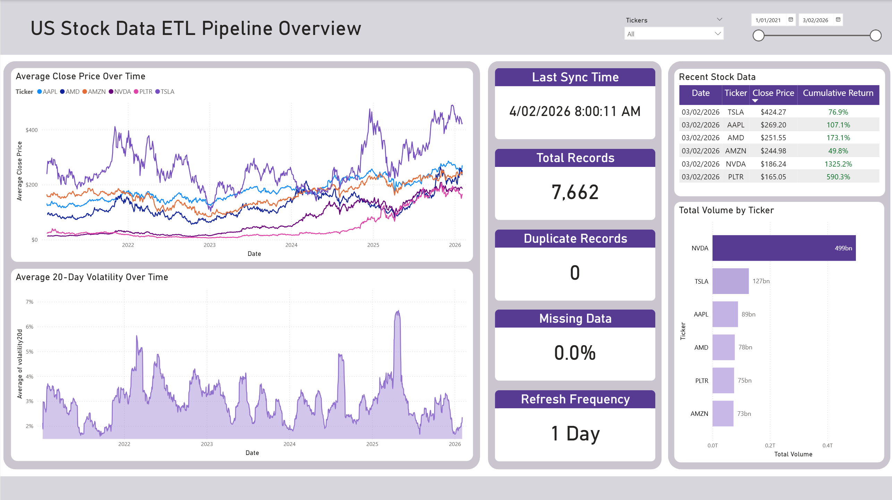

# Automated US Stock ETL Pipeline Project

An automated ETL pipeline that loads, processes, and stores US stock price and market holiday data into a SQL Server database. Data ingestion runs daily at 08:00 AM, handles incremental loads, and supports a multi-layer architecture: Raw, Silver (Clean), and Gold (Analytics).

## Table of Contents

1. [Architecture](#architecture)
2. [Features](#features)
3. [Used Languages and Modules](#used-languages-and-modules)
4. [ETL Steps](#etl-steps)
5. [Incremental Loading Strategy](#incremental-loading-strategy)
6. [Database Schema](#database-schema)
7. [Logging & Monitoring](#logging--monitoring)
8. [Visualisation](#visualisation)
9. [Known Issues and Constraints](#known-issues-and-constraints)
10. [Future Improvements](#future-improvements)

## Architecture

Raw (Bronze) → Clean (Silver) → Analytics (Gold)

- Raw: Original unprocessed data
- Clean: Type-casted, deduplicated
- Analytics: Business ready fact/dimension tables


## Features

- Incremental loading
- Modular Python ETL scripts
- SQL Server stored procedures for staging/clean
- Automation using SQL Server Agent
- Logging with timestamped logs
- Designed for daily production runs


## Used Languages and Modules

- Python 3.12
- pandas
- yfinance
- finnhub
- pyodbc
- SQL Server with ODBC Driver 17
- SQL Server Agent


## ETL Steps

1) Initial Setup (One-time)

    1. Create database, schemas and tables (*SQL*)
    2. Create required stored procedures (*SQL/Stored Procedure*)
    3. Perform the initial load for :
        - 'analytics.dim_date'
        - 'raw.us_market_holidays'
        (*Python + SQL*)

2) Automated Daily Pipeline (Runs every day at 8:00 AM)

    4. Fetch US stock market data from yfinance and load it into 'raw.us_stocks' (*Python*)
    5. Fetch US market holidays data from finnhub and load it into 'raw.us_market_holidays' (*Python*)
    6. Load ticker metadata and populate 'clean.dim_ticker' (*SQL/Stored Procedure*)
    7. Clean and standardize data from 'raw.us_market_holidays', then load it into 'clean.us_market_holidays' (*SQL/Stored Procedure*)
    8. Upsert processed holiday data from 'clean.us_market_holidays' into 'analytics.us_market_holidays' (*SQL/Stored Procedure*)
    9. Upsert ticker data from 'clean.dim_ticker' into 'analytics.dim_ticker' (only when changes are detected) (*SQL/Stored Procedure*)
    10. Extend 'analytics.dim_date' to maintain a rolling 5-year date range from the current date (*SQL/Stored Procedure*)
    11. Clean and type-cast stock data from 'raw.us_stocks', then load it into 'clean.us_stocks' (*SQL/Stored Procedure*)
    12. Transform cleaned stock data into an analytics-ready format and load it into 'analytics.fact_stock_daily' (*SQL/Stored Procedure*)




## Incremental Loading Strategy

- Uses 'analytics.etl_last_loaded' to track last loaded date

- Python ETL reads watermark
- Only new data after watermark is downloaded
- Stored procedures perform dedup by using (MERGE INTO ...)

```python
 # set the start date for our market data request
    last_loaded_date = getLastLoadedDate.getLastLoadedDate('us_stocks')
    start_date = datetime(year=2021, month=1, day=1).date()

    if last_loaded_date != None and last_loaded_date != -1:
        start_date = last_loaded_date[0] + timedelta(days=1)
```


## Database Schema

- **Raw (Bronze):** stores ingested data as-is (minimal changes)
- **Clean (Silver):** cleaned, standardized, and type-casted data
- **Analytics (Gold):** analytics-ready tables for Power BI reporting

| Raw (Bronze)             | Clean (Silver)             | Analytics (Gold)               |
| ------------------------ | -------------------------- | ------------------------------ |
| `raw.us_stocks`          | `clean.us_stocks`          | `analytics.fact_stock_daily`   |
| `raw.us_market_holidays` | `clean.us_market_holidays` | `analytics.us_market_holidays` |
|                          | `clean.dim_ticker`         | `analytics.dim_ticker`         |
|                          |                            | `analytics.dim_date`           |
|                          |                            | `analytics.etl_last_loaded`    |


## Logging & Monitoring

All ETL runs log into 'logs/logs.txt'


## Visualisation

I built a Power BI report to validate the analytics readiness of the Gold layer.
This is a simple, single-page verification dashboard designed to confirm that the data pipeline is running automatically on a daily basis.

By building this dashboard, I was able to demonstrate that the data is truly analytics-ready, as the visuals did not require any complex DAX or Power Query transformations.
Because the final dataset was already optimised for visualisation, the report refreshed in under one second, indicating both efficiency and good data modelling practices.




## Known Issues and Constraints

- The machine must remain awake for scheduled runs, as the automation is currently executed via SQL Server Agent.
    → This makes the pipeline dependent on a single local environment.
- Requires stable SQL Server connectivity (local instance).
    → Network interruptions or local system issues can stop the pipeline.
- The Finnhub API provides market holiday data only within a limited time range.
    → This limits the ability to fully automate long-range historical holiday ingestion.
- Since the pipeline is built and operated locally, it has limitations for scalability and future collaboration.
    → Multi-user development, deployment, and CI/CD workflows are not easily supported.

## Future Improvements

- Migrate the pipeline to a cloud-based platform (e.g., Databricks, Azure Data Factory, Azure SQL, etc.).
    → Enables scalable compute, easier scheduling, better reliability, and team collaboration.
- Improve the logging system to support monitoring and debugging.
    → Store logs in a structured format (e.g., log tables in SQL Server), making it easier to track job history, detect failures, and build alerting.
- Add automated alerting and monitoring (e.g., email/Teams notifications).
    → Helps detect failures immediately instead of relying on manual log checks.
- Improve data quality validation (schema checks, duplicate detection, null validation).
    → Prevents silent data issues from flowing into the analytics layer and Power BI reports.